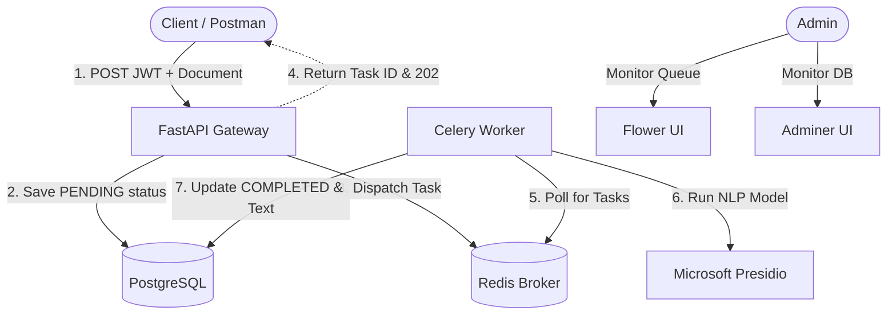

# 🛡️ Enterprise PII Gateway (Async Ingestion)

A production-grade, asynchronous microservice designed to ingest enterprise documents, perform context-aware PII redaction (NLP), and persist sanitized data securely. Built with modern Python architecture and strict separation of concerns.

## ✨ Key Features
* **Async Processing:** Offloads heavy CPU-bound NLP tasks to background workers (Celery + Redis) for zero API blocking.
* **Context-Aware Redaction:** Uses Microsoft Presidio (spaCy NLP) instead of brittle Regex for intelligent PII masking (names, credit cards, emails, etc.).
* **Enterprise Security:** Enforces strict cryptographic JWT signature validation. Zero hardcoded secrets (Environment Variables).
* **Zero Data Loss:** Relies on Redis as a message broker and PostgreSQL for persistent document states.
* **Fully Containerized:** 100% Dockerized architecture. One command spins up the API, Worker, Database, Broker, and UI monitors.

## 🏗️ Architecture



## 🚀 Quick Start (Local Development)

The entire infrastructure is dockerized. You do not need to install Python or Redis locally.

1. Clone the repository and navigate to the directory.
2. Create a `.env` file in the root directory (do not commit this):
   ```env
   DB_PASSWORD=your_secure_db_password
   JWT_SECRET=your_secure_jwt_secret
   ```
3. Spin up the enterprise stack:
   ```bash
   docker compose up -d --build
   ```
4. **Access the Services:**
   * **API Docs (Swagger):** `http://localhost:8000/docs`
   * **Queue Monitor (Flower):** `http://localhost:5555`
   * **Database UI (Adminer):** `http://localhost:8080`

## 🧠 FDE Milestones: What I Learned
Building this project demonstrated core Forward Deployed Engineering competencies:
1. **Containerization & Docker Networking:** Orchestrating multiple containers (API, Worker, DB, Broker, UI) with a single `docker-compose.yml`, while managing internal DNS and secure `.env` injection.
2. **Asynchronous Architecture:** Mastering the Polling Pattern (`202 Accepted`) and decoupling the API from heavy workloads using Celery and Redis.
3. **Data Privacy (NLP vs Regex):** Implementing `Microsoft Presidio` for context-aware NLP PII redaction, avoiding the pitfalls (false positives/negatives) of standard Regex.
4. **Authentication:** Building real cryptographic JWT signature validation (`pyjwt`) inside FastAPI dependency injection.

## 🛠️ Tech Stack
* **API Framework:** FastAPI, Uvicorn
* **Task Queue:** Celery, Redis
* **AI / NLP Engine:** Microsoft Presidio, spaCy
* **Database & ORM:** PostgreSQL, SQLModel
* **Infrastructure:** Docker, Docker Compose, uv (Astral)

---
## 📐 Architecture Decision Records (ADRs)

### 📄 ADR 001: ORM and Database Choice
**Status:** `🟢 Accepted` | **Date:** Aug 2026

* **Context:** We need a structured way to store document metadata and status without writing raw SQL, while keeping API validation simple.
* **Decision:** We chose **SQLModel**.
* **Reasoning:** SQLModel seamlessly combines Pydantic and SQLAlchemy. This allows us to use a single data class for both API payload validation and Database schema definition, strictly adhering to the DRY (Don't Repeat Yourself) principle.

---

### 🚀 ADR 002: Asynchronous Background Processing
**Status:** `🟢 Accepted` | **Date:** Aug 2026

**Context**
PII redaction (Regex masking) in large enterprise documents is a CPU-bound operation. Running this directly on the main API event loop will block incoming requests and cause service timeouts. We require a highly reliable background processing pipeline.

**Decision & Reasoning**
Selected **Celery** as the task queue, with **Redis** as the message broker, and **Flower** for real-time observability. 
Since PII regex scanning is CPU-bound rather than I/O-bound, Celery's synchronous worker model is not a bottleneck. Celery guarantees **Zero-Data-Loss** during unexpected API restarts and provides enterprise-grade visual monitoring out-of-the-box.

---

### 🛡️ ADR 003: PII Redaction Engine
**Status:** `🟢 Accepted` | **Date:** Aug 2026

**Context**
The core business logic requires detecting and masking Personally Identifiable Information (PII) within unstructured enterprise documents. The solution must be highly accurate, context-aware, and compliant with strict data privacy standards.

**Decision & Reasoning**
Selected **Microsoft Presidio**. By utilizing a local NLP-based engine, we achieve context-aware PII redaction without ever sending sensitive plaintext documents outside our secure perimeter. This guarantees zero third-party data leakage, avoids cloud vendor lock-in, and eliminates network latency associated with external API calls, making it ideal for strict enterprise environments.